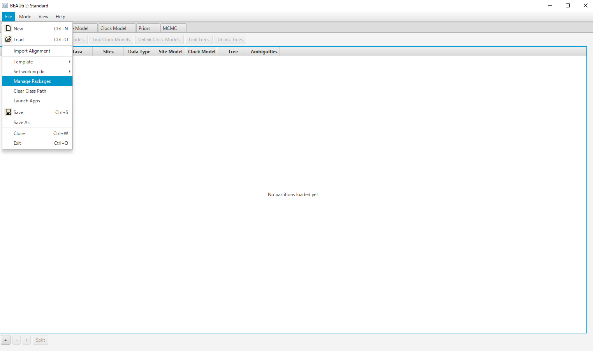
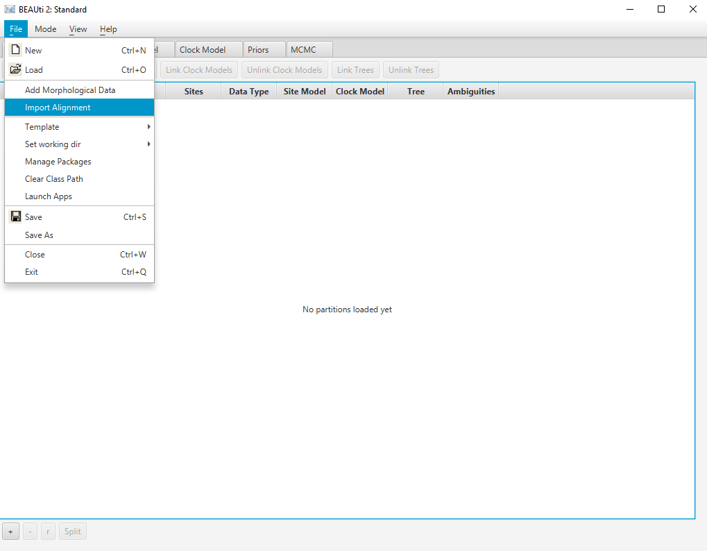
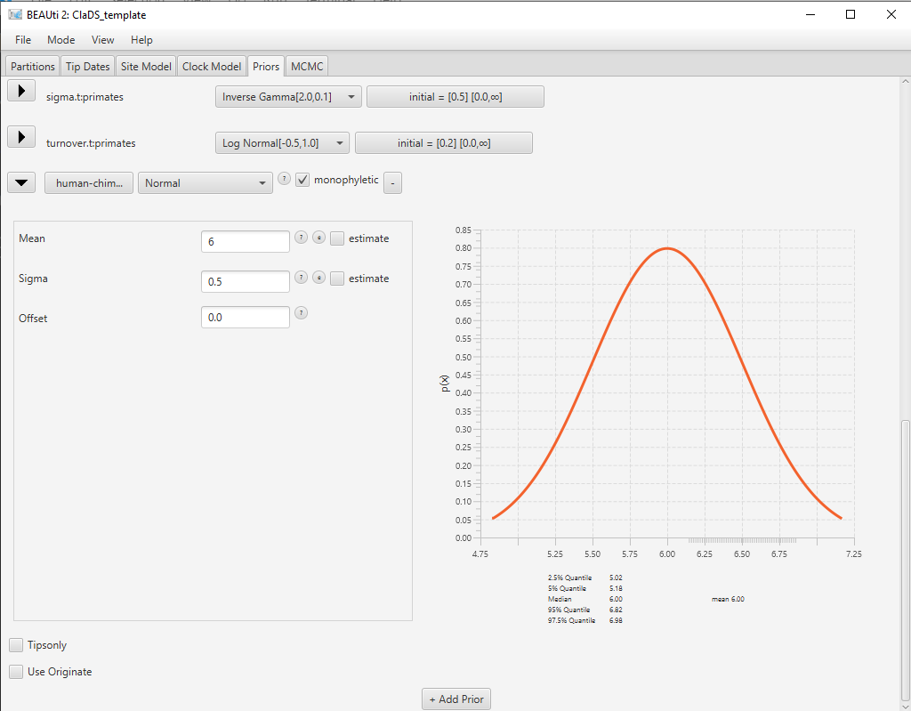
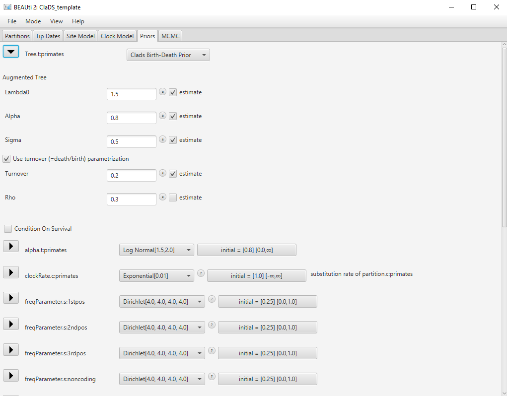

# Background

This tutorial will show how to configure and run a model with progressive changes in birth and death rates, using the ClaDS tree prior implemented in the BEAST2 package ClaDS.

The Cladogenetic Diversification rate Shift (ClaDS) model is a birth-death process which is designed to represent gradual, progressive changes in rates throughout a phylogeny. It is similar in principle to an autocorrelated clock model, as new birth and death rates are drawn for each edge from a distribution which depends on the ancestral rates.

As an example, we consider a lineage , with its associated birth rate  and death rate . At the next birth event, the lineage  splits into lineages  and . The new birth rates  and  are drawn from a lognormal distribution with mean  and standard deviation . , , and the birth rate at the root  are parameters of the model and can be estimated by the inference.

The package includes two separate options for sampling the death rate:
1. New death rates are not sampled separately, but controlled by the turnover parameter , which is the same throughout the phylogeny and can be estimated by the inference. Thus for each lineage , we have . This is the parametrization by default.
2. New death rates are sampled from the ancestral rates, following a similar lognormal distribution to the birth rates. Thus, for lineage  with descendants  and , we draw the new death rates  and  from a lognormal distribution with mean  and standard deviation . In this case and similar to the birth rate, , , and the death rate at the root  are parameters of the model and can be estimated by the inference.
The choice of death rate parametrization is left to the user, and will depend on the dataset and on which characteristics are thought to drive the variations in rate. The first parametrization is appropriate when the variations of both rates are tied to the same factor and thus strongly correlated, whereas the second parametrization is more appropriate when the variations in birth rates and death rates are uncorrelated. The first parametrization is also more simple and contains less parameters, and thus may be easier to use when the available data is limited.

Finally, it is also possible to set either the birth rate or the death rate to be constant throughout the phylogeny, by setting the corresponding trend parameter  or  to 1 and the corresponding standard deviation parameter  or  to 0. This will lead to  or  for all lineages.

More details on the model and an evaluation of its performance in various conditions can be found in the original publication . The specific implementation of ClaDS as a BEAST2 package is presented in a separate article .

----

# Programs used in this Exercise 

### BEAST2 - Bayesian Evolutionary Analysis Sampling Trees 2

BEAST2 is a free software package for Bayesian evolutionary analysis of molecular sequences using MCMC and strictly oriented toward inference using rooted, time-measured phylogenetic trees . This tutorial uses BEAST2 version 2.6, however the ClaDS package is also available for BEAST2 version 2.7 and works the same way.

### BEAUti -- Bayesian Evolutionary Analysis Utility

BEAUti is a utility program with a graphical user interface for creating BEAST2 input files, which are written in XML. The eXtensible Markup Language (XML) is a general-purpose markup language, which allows for the combination of text and additional information. The use of the XML makes analysis specification very flexible and readable by both the program and people. The XML file specifies all the components of the analysis, including sequences, node calibrations, models, priors, output file names.

### TreeAnnotator

TreeAnnotator is used to summarize the posterior sample of trees to produce a maximum clade credibility tree and summarize the posterior estimates of other parameters that can be easily visualized on the tree (e.g. node height). This program is also useful for comparing a specific tree topology and branching times to the set of trees sampled in the MCMC analysis. 

### Tracer

Tracer is used for assessing and summarizing the posterior estimates of the various parameters sampled by the Markov Chain. This program can be used for visual inspection and assessment of convergence and it also calculates 95% credible intervals (which approximate the 95% highest posterior density intervals) and effective sample sizes (ESS) of parameters. Contrary to the other software in this section, Tracer is not distributed with BEAST2 and needs to be downloaded separately [here](http://beast.community/tracer).

----

# Practical: Lineage-specific Birth and Death Rate Inference Under the ClaDS Model

## Dataset: Lizards alignment

The dataset used in this tutorial is an alignment of two genes (12S rRNA and cytochrome B) for 238 extant species of Australian sphenomorphine skinks. This alignment was originally published in , and included a total of 6 genes. To keep this tutorial simple, we limit ourselves to the two longest genes.

## Setting up the XML file

This section will demonstrate how to create an XML configuration file using BEAUti, which will then be used to run the analysis in BEAST2.

### Package installation

The first step is to install the ClaDS package, which will allow us to set up and run an analysis with lineage-specific birth and death rates.

> Launch **BEAUti**, then open the **BEAST2 Package Manager** by navigating to **File > Manage Packages**. ([Figure 1](#packageManage1))
> 

<figure>
	<a id="packageManage1"></a>
	
	<figcaption>Figure 1: Finding the BEAST2 Package Manager.</figcaption>
</figure>
<br>


> Install the **ClaDS** package by selecting it and clicking the **Install/Upgrade** button. ([Figure 2](#packageManage2))
> 

<figure>
	<a id="packageManage2"></a>
	
	<figcaption>Figure 2: The BEAST2 Package Manager.</figcaption>
</figure>
<br>


BEAUti needs to be restarted for the newly installed package to be loaded properly.

> Close the **BEAST2 Package Manager** and **_restart_** BEAUti to fully load the **ClaDS** package.
> 

### Setting the templates

BEAUti uses templates to define specific model configurations. The ClaDS template needs to be selected to set up an analysis using the ClaDS model.

> Select the **ClaDS template** by navigating to **File > Template**. ([Figure 3](#template))
> 

<figure>
	<a id="template"></a>
	
	<figcaption>Figure 3: Selecting the ClaDS template.</figcaption>
</figure>
<br>

### Importing the alignment

The first step of the setup is to import the two alignments that we will be using in this analysis.

> In the **Partitions** panel, import the alignment by navigating to **File > Import Alignment** in the menu ([Figure 4](#importAlignment)) and then finding the `x12S.nex` file on your computer **or** simply drag and drop the file into the **BEAUti** window.
> Repeat the operation with the `xcytB.nex` alignment file.
> 

<figure>
	<a id="importAlignment"></a>
	
	<figcaption>Figure 4: Importing the alignment into BEAUti.</figcaption>
</figure>
<br>


### Linking the tree

Since we have imported two different alignments, BEAUti has automatically created two separate substitution models, clock models and trees for each of the alignments. We will keep the two substitution models, however we would like to estimate only one clock model and one phylogeny for both genes. Thus we need to link the clock models and trees for both alignments.

> In the **Partitions** panel, select both alignments by holding the **Ctrl** key and clicking on both lines.
> Click on the **Link Clock Models** button. You should see that the **Clock Model** column now contains the same value for both alignments.
> Click on the **Link trees** button. You should see that the **Tree** column now contains the same value for both alignments.
> Optionally, rename the tree and clock model to **lizards** by clicking on the name field, typing the new name then pressing **Enter**. 
>

The final alignment configuration is shown in [Figure 5](#linkedTree).

<figure>
	<a id="linkedTree"></a>
	
	<figcaption>Figure 5: Partition panel with linked trees.</figcaption>
</figure>
<br>

### Setting up the substitution models

The next set is to set up the substitution models for each alignments, found in the **Site Model** panel. Following the original analysis, we will set up GTR + G models for both alignments, with the number of rate categories set to 4.

> In the **Site Model** panel, set the **Gamma Category Count** to **4**.
> Click on the arrow next to **JC69**, and select the **GTR** model.
> Select the second alignment in the **Partition** list on the left, and repeat the same set up. 
>

The final substitution model configuration is shown in [Figure 6](#subst).

<figure>
	<a id="subst"></a>
	
	<figcaption>Figure 6: Site model panel with GTR+G model.</figcaption>
</figure>
<br>

### Setting up the clock priors

Next come the clock model, and again we will follow the original study and use a relaxed lognormal clock model. 

> In the **Clock Model** panel, Click on the arrow next to **Strict Clock**, and select the **Relaxed Clock Log Normal** model.
>

The final clock model configuration is shown in [Figure 7](#clock). You will notice that the **estimate** checkbox next to **Clock.rate** is unchecked and greyed out. This is normal: our dataset is composed entirely of extant samples, and we have not yet added any calibration times, thus the clock rate cannot be estimated. We will add those calibration times further in this tutorial.

<figure>
	<a id="clock"></a>
	
	<figcaption>Figure 7: Clock model panel with relaxed lognormal model.</figcaption>
</figure>
<br>

### Adding calibration times

The next step is to look at the different priors, in the **Priors** panel. The default priors on the parameter priors are reasonable for this dataset so we will not change them. However, as mentioned in the previous section, we need to add calibration times to our analysis in order to estimate the clock rate and node ages. We will accomplish this by setting MRCA priors, which add priors on the age of the most recent common ancestor of selected tips. These priors can also constrain certain subclades of the tree to be monophyletic.

>  In the **Priors** panel, click on the **+ Add Prior** button at the bottom of the list. This opens the **Taxon Set Editor**.
>  Select the taxa **SPHENOMORPHUS_JOBIENSIS** and **SPHENOMORPHUS_SOLOMONIS** and click on the **>>** button to add them to the set.
>  Write the name of the taxon set **ngsphenos** in the box **Taxon set label** and click **OK** to confirm.

The new prior now appears in the list as in [Figure 7](#MRCAprior), but it is not completely configured yet. We still need to select a distribution for the age of our chosen subclade.

<figure>
	<a id="MRCAprior"></a>
	
	<figcaption>Figure 6: MRCA prior without age distribution.</figcaption>
</figure>
<br>

>  Click on the arrow on the right to **[none]** and select a **LogNormal** distribution for the age of the clade.
>  Click on the arrow on the left of **ngsphenos.prior** to open the detailed view of the distribution.
>  Set the **M** parameter (mean) to **2.986** and the **S** parameter (standard deviation) to **0.288034** ([Figure 7](#MRCApriorDet)).
>  Click on the arrow again to close the detailed view.
>

You will notice that a new parameter (and prior) has been added to the list, the mean clock rate **ucldMean.c:lizards**. By adding a prior on the age of one of the nodes in the tree, we have calibrated our time tree and BEAUti has automatically adjusted the analysis as a result.

<figure>
	<a id="MRCApriorDet"></a>
	
	<figcaption>Figure 6: MRCA prior with age distribution.</figcaption>
</figure>
<br>

Similarly, we will set two additional node calibrations:
 1. MRCA prior with a taxon set named **ozsphenos**, which contains all taxa except 5 (**PAPUASCINCUS_SP**, **PRASINOHAEMA_VIRENS**, **SPHENOMORPHUS_JOBIENSIS**, **SPHENOMORPHUS_MUELLERI** and **SPHENOMORPHUS_SOLOMONIS**). The age prior for this subclade is LogNormal(M = **3.2308**, S = **0.20596**).
 2. MRCA prior with a taxon set named **allsphenos**, which contains all taxa (and thus represents a prior on the root of the tree). The root age prior is LogNormal(M = **3.7305**, S = **0.17713**).
 
In addition to the age calibrations, we will also constrain the **ozsphenos** subclade to be monophyletic.

>  Check the **monophyletic** checkbox next to the **ozsphenos.prior** calibration.
>

The final result is shown in [Figure 7](#MRCApriorsAll). All node calibrations used in this tutorial were taken from the original analysis .

<figure>
	<a id="MRCApriorsAll"></a>
	
	<figcaption>Figure 6: Priors panel with all three MRCA priors.</figcaption>
</figure>
<br>

### The tree prior

Next, we will specify the tree prior, i.e. the ClaDS model. By default most of the parameters of the model are estimated, so it is not necessary to change their starting values. However, the extant sampling proportion () is fixed, and so needs to be correct. The dataset contains 85% of the extant diversity of the Australian sphenomorphine clade , so we will set .

>  Click on the arrow next to **Tree** to open the **ClaDS** options. 
>  Change the value for **rho** (extant sampling proportion) of the ClaDS model to **0.85** ([Figure 7](#treePrior)).
> 

<figure>
	<a id="treePrior"></a>
	
	<figcaption>Figure 7: Setting the ClaDS tree prior.</figcaption>
</figure>
<br>

Note that many other options are available in this section, such as fixing the value of some parameters (**estimate** checkboxes), or changing the parametrization of the death rate (**Use fixed turnover** checkbox).

### The parameter priors

Most of the default parameter priors are reasonable, so we will not change them. However, the default prior for the mean clock rate is a uniform distribution from 0 to Infinity, which allows values which are too large for most datasets. A reasonable value for the global substitution rate of skinks is between 10^-3 to 1 substitution/site/My, so we will set a lognormal prior around this range of values.

>  Use the dropdown menu on the right of **ucldMean.c:lizards* to select a **LogNormal** distribution for this prior.
>  Click on the arrow left to **ucldMean.c:lizards** to open the detailed options. 
>  Set the mean parameter **M** to **0.1** and the standard deviation parameter **S** to **1.0**. Check the **Mean in Real Space** checkbox.
>  Click on the arrow again to close the detailed view.
> 

The final configuration for this prior is shown in [Figure 7](#clockPrior).

<figure>
	<a id="clockPrior"></a>
	
	<figcaption>Figure 7: Setting the prior on the mean clock rate.</figcaption>
</figure>
<br>

### MCMC options

The next step is to set the options for running the chain, in the **MCMC** panel. We can see that several loggers are set by default:

- the regular trace log, which records the posterior, likelihood and prior, as well as parameter values for the substitution, clock and tree models.
- the screenlog, which shows the advancement of the chain to the screen.
- the tree log, which will log the trees in Nexus format, with the estimated clock rate on each edge as metadata.
- the tree rates log, which will log the trees in Nexus format, with the estimated birth and death rates on each edge as metadata.
 
This last log is specific to ClaDS. The only thing we will change here are the names of the log files, to ensure we can find them again.
>  Switch to the **MCMC** panel.
>  In the **tracelog**, change the **File Name** to **lizards.log**.
>  In the **treeRatesLog**, change the **File Name** to **lizards.rates.trees**.
>

For this tutorial, we will also adjust the chain length and sampling frequency, in order for the inference to complete rapidly.

>  In the **MCMC** panel, change the **Chain Length** to **100000**.
>  In the **tracelog**, **treelog** and **treeRatesLog**, change the **Log Every** to **1000**.
>

Once all the options have been set, the final step is to save the XML.

> Save the XML file as `lizards_clads.xml` by navigating to **File > Save**.
> 

## Running the analysis in BEAST2

> Start **BEAST2** and choose the file `lizards_clads.xml`. 
> 
> If you have **BEAGLE** installed tick the box to **Use BEAGLE library if available**, which will make the run faster.
>
> Hit **Run** to start the analysis.
> 

The run should take about 5-15 minutes.

## Analyzing the output

### Output files

Our run has generated 3 different files:

* `lizards_clads.log` which is the general trace log.
* `lizards.trees` and `lizards.rates.trees` which recorded the sampled trees in Nexus format.

Note that our shortened analysis has probably not converged (as can easily be seen when importing the log file into Tracer). Thus we provide files from a longer run in the tutorial files, which we will use in the following section.

### Analyzing the log files

We will use the software Tracer to analyze the log files. The general trace log is not very interesting in our case, as we used a fixed tree. Next, we will look at the MSBD model log, contained in the file `hummingbirds.hummingbirds.states.log`.
[Figure 10](#gamma) shows the estimated posterior distribution for the type change rate, which in this analysis has a median estimate of 5.35E-3, with a 95% HPD of [4.04E-4 ; 0.014].

<figure>
	<a id="gamma"></a>
	
	<figcaption>Figure 10: Estimated posterior distribution of the type change rate, as shown in Tracer.</figcaption>
</figure>
<br>

One important thing to note is that the estimates of `lambda` and `mu` in this log should not be directly used. This is due to the fact that the types in our model are not tied to tips, so they may not represent the same evolutionary regimes in all samples. For instance, in the presence of two regimes, there may be samples where type 0 corresponds to the regime with higher birth, while in other samples this regime is represented by type 1. We can see this in [Figure 11](#lbda), where the estimate for `lambda_0` shows a discrepancy around 6.5E7 samples, which corresponds to `lambda_0` and `lambda_1` exchanging values. This also means that ESS values for these parameters may be low even if the chain has converged.

<figure>
	<a id="lbda"></a>
	
	<figcaption>Figure 11: Trace of the birth rate for type 0, as shown in Tracer.</figcaption>
</figure>
<br>

In order to look at the actual birth and death rates estimates, we can look at the tip rates log, stored in the file `hummingbirds.hummingbirds.rates.log`. [Figure 12](#tip_uni) and [Figure 13](#tip_bi) show examples of the estimated posterior distributions of the birth rate for two different tips. 

<figure>
	<a id="tip_uni"></a>
	
	<figcaption>Figure 12: Estimated posterior distribution of the birth rate at tip Topaza.pella, as shown in Tracer.</figcaption>
</figure>
<br>

<figure>
	<a id="tip_bi"></a>
	
	<figcaption>Figure 13: Estimated posterior distribution of the birth rate at tip Amazilia.leucogaster, as shown in Tracer.</figcaption>
</figure>
<br>

We can see that these two tips present two very different configurations. The first tip shows a unimodal posterior distribution, which indicates that it is confidently assigned to one particular evolutionary regime. On the other hand, the second tip presents a bimodal distribution, indicating that there are two distinct evolutionary regimes, with two distinct birth rates, which it can be assigned to. 
This is important to note because the usual metrics used to summarize posterior distributions, i.e. the median and 95% HPD interval, work well in the first case but can give a misleading representation of the posterior in the second case. In this case the median estimate for the birth rate of _Amazilia.leucogaster_ is 0.40, which corresponds approximately to the second mode of the distribution, however neither the median nor the 95% HPD interval show the existence of a second possible regime, with birth rate 0.22.

### Analyzing the trees

Another way to visualize the results is to look at the rates as plotted on the tree. We can use TreeAnnotator to build an MCC tree from the tree log in the file `hummingbirds.hummingbirds.rates.trees`. Since we also logged the birth and death rates for each edge in the tree log, these parameters will also be summarized along with the tree.

> Start **TreeAnnotator** and set the input tree to the tree log file.
>
> Set the burn-in percentage to 10%.
> 
> Give a name to the output file, for instance `hummingbirds.MCC.tre`.
>
> Finally, click **Run** to start the summary.

The MCC tree can be loaded into any tree visualization software, such as FigTree or IcyTree. We are going to use the R script provided in this tutorial `plot_MCC.R`. This script takes as input the MCC tree file and an output file to store the plot, and it will plot the MCC tree with edges coloured by the median estimates of the birth and death rates.
Run the following commands in an R console to create the plots:

```R
source("plot_MCC.R")
MCC_colour_plot("hummingbirds.MCC.tre", plotfile = "hummingbirds_MCC.pdf")
```

[Figure 14](#mcc_birth) and [Figure 15](#mcc_death) show the resulting plots for the birth rate and the death rate, respectively.

<figure>
	<a id="mcc_birth"></a>
	
	<figcaption>Figure 14: MCC tree with edges coloured by the median birth rate.</figcaption>
</figure>
<br>

<figure>
	<a id="mcc_death"></a>
	
	<figcaption>Figure 15: MCC tree with edges coloured by the median death rate.</figcaption>
</figure>
<br>

We can see that while most of the tree shares one evolutionary regime (in red), some clades are inferred to have evolved under a second regime (in green), with higher birth and death rates. 
From this figure it is not possible to tell whether the clades coloured in yellow-orange represent a third intermediate regime, or whether there is uncertainty as to which of the two regimes they belong to.

Going back to the rates log file and using the full posterior distribution rather than just the median, we see that the intermediate colour is likely due to uncertainty rather than a third regime.

# Useful Links

- [Bayesian Evolutionary Analysis with BEAST 2](http://www.beast2.org/book.html) 
- BEAST 2 website and documentation: [http://www.beast2.org/](http://www.beast2.org/)
- BEAST 1 website and documentation: [http://beast.bio.ed.ac.uk](http://beast.bio.ed.ac.uk)
- Join the BEAST user discussion: [http://groups.google.com/group/beast-users](http://groups.google.com/group/beast-users) 

----

# Relevant References



-------
