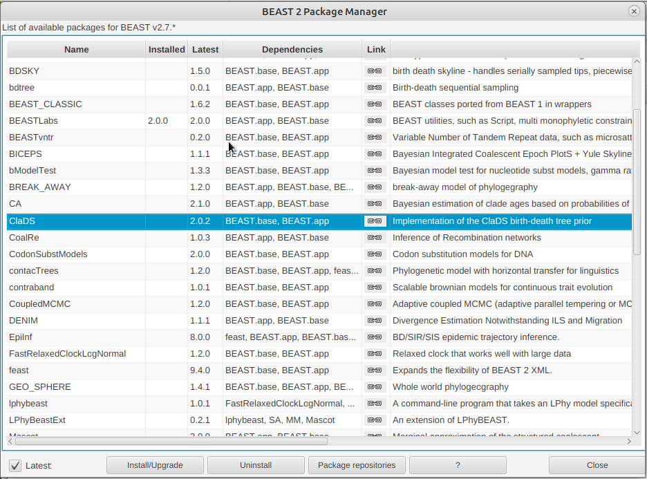
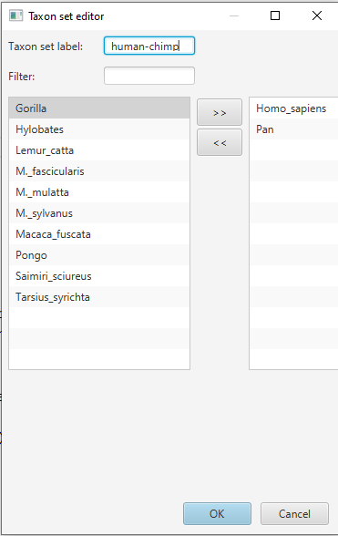
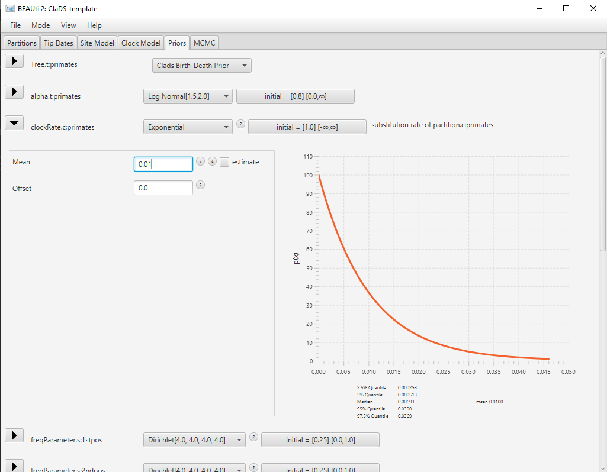

# Background

This tutorial will show how to configure and run a model with progressive changes in birth and death rates, using the ClaDS tree prior implemented in the BEAST2 package ClaDS.

The Cladogenetic Diversification rate Shift (ClaDS) model is a birth-death process which is designed to represent gradual, progressive changes in rates throughout a phylogeny. It is similar in principle to an autocorrelated clock model, as new birth and death rates are drawn for each edge from a distribution which depends on the ancestral rates.

As an example, we consider a lineage , with its associated birth rate  and death rate . At the next birth event, the lineage  splits into lineages  and . The new birth rates  and  are drawn from a lognormal distribution with mean  and standard deviation . The model parameters , , and the birth rate at the root, , can be estimated by the inference.

The package includes two separate options for sampling the death rate:
1. New death rates are not sampled separately, but controlled by the turnover parameter , which is the same throughout the phylogeny and can be estimated by the inference. Thus for each lineage , we have . This is the parametrization by default.
2. New death rates are sampled from the ancestral rates, following a similar lognormal distribution to the birth rates. Thus, for lineage  with descendants  and , we draw the new death rates  and  from a lognormal distribution with mean  and standard deviation . In this case and similar to the birth rate, , , and the death rate at the root, , are parameters of the model and can be estimated by the inference.
The choice of death rate parametrization is left to the user, and will depend on the dataset and on which characteristics are thought to drive the variations in rate. The first parametrization is appropriate when the variations of both rates are tied to the same factor and thus strongly correlated, whereas the second parametrization is more appropriate when the variations in birth rates and death rates are uncorrelated. The first parametrization is also more simple and contains less parameters, and thus may be easier to use when the available data is limited.

Finally, it is also possible to set either the birth rate or the death rate to be constant throughout the phylogeny, by setting the corresponding trend parameter  or  to 1 and the corresponding standard deviation parameter  or  to 0. This will lead to  or  for all lineages.

More details on the model and an evaluation of its performance in various conditions can be found in the original publication . The specific implementation of ClaDS as a BEAST2 package is presented in a separate article .

----

# Programs used in this Exercise 

### BEAST2 - Bayesian Evolutionary Analysis Sampling Trees 2

BEAST2 is a free software package for Bayesian evolutionary analysis of molecular sequences using MCMC and strictly oriented toward inference using rooted, time-measured phylogenetic trees . This tutorial uses BEAST2 version 2.6, however the ClaDS package is also available for BEAST2 version 2.7 and works the same way.

### BEAUti -- Bayesian Evolutionary Analysis Utility

BEAUti is a utility program with a graphical user interface for creating BEAST2 input files, which are written in XML. The eXtensible Markup Language (XML) is a general-purpose markup language, which allows for the combination of text and additional information. The use of the XML makes analysis specification very flexible and readable by both the program and people. The XML file specifies all the components of the analysis, including sequences, node calibrations, models, priors, output file names.

### TreeAnnotator

TreeAnnotator is used to summarize the posterior sample of trees to produce a maximum clade credibility tree and summarize the posterior estimates of other parameters that can be easily visualized on the tree (e.g. node height). This program is also useful for comparing a specific tree topology and branching times to the set of trees sampled in the MCMC analysis. 

### Tracer

Tracer is used for assessing and summarizing the posterior estimates of the various parameters sampled by the Markov Chain. This program can be used for visual inspection and assessment of convergence and it also calculates 95% credible intervals (which approximate the 95% highest posterior density intervals) and effective sample sizes (ESS) of parameters. Contrary to the other software in this section, Tracer is not distributed with BEAST2 and needs to be downloaded separately [here](http://beast.community/tracer).

----

# Practical: Lineage-specific Birth and Death Rate Inference Under the ClaDS Model

## Dataset

The dataset used in this tutorial is an alignment of sequences sampled from twelve primate species, also used in the Introduction tutorial.

## Setting up the XML file

This section will demonstrate how to create an XML configuration file using BEAUti, which will then be used to run the analysis in BEAST2.

### Package installation

The first step is to install the ClaDS package, which will allow us to set up and run an analysis with lineage-specific birth and death rates.

> Launch **BEAUti**, then open the **BEAST2 Package Manager** by navigating to **File > Manage Packages**. ([Figure 1](#packageManage1))
> 

<figure>
	<a id="packageManage1"></a>
	
	<figcaption>Figure 1: Finding the BEAST2 Package Manager.</figcaption>
</figure>
<br>


> Install the **ClaDS** package by selecting it and clicking the **Install/Upgrade** button. ([Figure 2](#packageManage2))
> 

<figure>
	<a id="packageManage2"></a>
	
	<figcaption>Figure 2: The BEAST2 Package Manager.</figcaption>
</figure>
<br>


BEAUti needs to be restarted for the newly installed package to be loaded properly.

> Close the **BEAST2 Package Manager** and **_restart_** BEAUti to fully load the **ClaDS** package.
> 

### Setting the templates

BEAUti uses templates to define specific model configurations. The ClaDS template needs to be selected to set up an analysis using the ClaDS model.

> Select the **ClaDS template** by navigating to **File > Template**. ([Figure 3](#template))
> 

<figure>
	<a id="template"></a>
	
	<figcaption>Figure 3: Selecting the ClaDS template.</figcaption>
</figure>
<br>

### Importing the alignment

The first step of the setup is to import the alignment that we will be using in this analysis.

> Open **BEAUti**. Navigate to **File > Import Alignment** ([Figure 4](#importAlignment)) and select the file `primate-mtDNA.nex` in the data directory or simply drag and drop the file in the **Partitions** window.
> 

<figure>
	<a id="importAlignment"></a>
	
	<figcaption>Figure 4: Importing the alignment into BEAUti.</figcaption>
</figure>
<br>


### Linking the tree and clock model

Since we have imported an alignment containing different partitions, BEAUti has automatically created separate substitution models, clock models and trees for each of the partitions. We will keep the separate substitution models, however we would like to estimate only one clock model and one phylogeny. Thus we need to link the clock models and trees for all partitions.

> In the **Partitions** panel, select all partitions.
> Click on the **Link Clock Models** button. You should see that the **Clock Model** column now contains the same value for all partitions.
> Click on the **Link trees** button. You should see that the **Tree** column now contains the same value for all partitions.
> Optionally, rename the tree and clock model to **primates** by clicking on the name field, typing the new name then pressing **Enter**. 
>

The final alignment configuration is shown in [Figure 5](#linkedModels).

<figure>
	<a id="linkedModels"></a>
	
	<figcaption>Figure 5: Partition panel with linked tree and clock model.</figcaption>
</figure>
<br>

### Setting up the substitution models

The next set is to set up the substitution models for each alignments, found in the **Site Model** panel. We will set up HKY + G models for both alignments, with the number of rate categories set to 4.

> In the **Site Model** panel, set the **Gamma Category Count** to **4**.
> Click on the arrow next to **JC69**, and select the **HKY** model.
> Select the remaining three partitions (use **shift+click**). 
> Select `noncoding` and click **OK** to to clone the site model for the other three partitions from `noncoding`.
>

The final substitution model configuration is shown in [Figure 6](#subst).

<figure>
	<a id="subst"></a>
	
	<figcaption>Figure 6: Site model panel with HKY+G model.</figcaption>
</figure>
<br>

### Setting priors

#### Adding calibration times

The next step is to look at the different priors, in the **Priors** panel. The default priors for most parameters are reasonable for this dataset so we will not change them. However, we need to add calibration times to our analysis in order to estimate the clock rate and node ages. We will accomplish this by setting an MRCA prior, which adds a prior on the age of the most recent common ancestor of selected tips. These priors can also constrain certain subclades of the tree to be monophyletic.

>  In the **Priors** panel, click on the **+ Add Prior** button at the bottom of the list and select the **MRCA Prior**. This opens the **Taxon Set Editor**.
>  Select the taxa **Homo_Sapiens** and **Pan** and click on the **>>** button to add them to the set.
>  Write the name of the taxon set **human-chimp** in the box **Taxon set label** ([Figure 7](#taxonSet)) and click **OK** to confirm.
>

<figure>
	<a id="taxonSet"></a>
	
	<figcaption>Figure 7: Taxon set editor.</figcaption>
</figure>
<br>

The new prior now appears at the bottom of the list of priors, but it is not completely configured yet. We still need to set this subclade to be monophyletic, and select a distribution for the age of its most recent common ancestor.

>  Click on the arrow on the right to **[none]** and select a **Normal** distribution for the age of the clade.
>  Click on the arrow on the left of **human-chimp.prior** to open the detailed view of the distribution.
>  Set the **Mean** parameter of the distribution to **6** and the **Sigma** parameter of the distribution to **0.5** ([Figure 8](#MRCApriorDet)).
>  Click on the arrow again to close the detailed view.
>  Check the **monophyletic** checkbox next to the **human-chimp.prior**.
>

<figure>
	<a id="MRCApriorDet"></a>
	
	<figcaption>Figure 8: MRCA prior with age distribution.</figcaption>
</figure>
<br>

You will notice that a new parameter (and prior) has been added to the list, the mean clock rate **clockRate.c:primates**. By adding a prior on the age of one of the nodes in the tree, we have calibrated our time tree and BEAUti has automatically adjusted the analysis as a result.


### The tree prior

Next, we will take a look the tree prior, i.e. the ClaDS model. By default most of the parameters of the model are estimated, so it is usually not necessary to change their starting values. However, the extant sampling proportion () is fixed, and so needs to be correct. Our dataset contains 12 taxa compared to an estimated 414 extant species for the clade of primates, so the correct extant sampling probability would be . But the ClaDS package performs badly for low sampling probabilities, so for the purpose of this exercise we will assume an extant sampling probability of .

>  Click on the arrow next to **Tree** to open the **ClaDS** options. 
>  Change the value for **rho** (extant sampling proportion) of the ClaDS model to **0.3** ([Figure 9](#treePrior)).
> 

<figure>
	<a id="treePrior"></a>
	
	<figcaption>Figure 9: The ClaDS tree prior.</figcaption>
</figure>
<br>

Note that many other options are available in this section, such as fixing the value of some parameters (**estimate** checkboxes), or changing the parametrization of the death rate (**Use fixed turnover** checkbox). Our current dataset only contains extant species, so it unlikely that we will be able to estimate the death rate precisely. In consequence, we will set the death rate by using the simpler constant turnover model, which is the default.


### The parameter priors

Most of the default parameter priors are reasonable, so we will not change them. However, the default prior for the mean clock rate is a uniform distribution from 0 to Infinity, which allows values which are too large for most datasets. A reasonable value for the global substitution rate of primates is on the order of  substitution/site/My, so we will set a exponential prior around this value.

>  Use the dropdown menu on the right of **clockRate.c:primates** to select a **Exponential** distribution for this prior.
>  Click on the arrow left to **clockRate.c:primates** to open the detailed options. Set the **Mean** parameter to **0.01**.
>  Click on the arrow again to close the detailed view.
> 

The final configuration for this prior is shown in [Figure 10](#clockPrior).

<figure>
	<a id="clockPrior"></a>
	
	<figcaption>Figure 10: Setting the prior on the clock rate.</figcaption>
</figure>
<br>

### MCMC options

The next step is to set the options for running the chain, in the **MCMC** panel. We can see that several loggers are set by default:

- the regular trace log, which records the posterior, likelihood and prior, as well as parameter values for the substitution, clock and tree models.
- the screenlog, which shows the advancement of the chain to the screen.
- the tree log, which will log the trees in Nexus format, with the estimated clock rate on each edge as metadata.
- the tree rates log, which will log the trees in Nexus format, with the estimated birth and death rates on each edge as metadata.
 
This last log is specific to ClaDS. The only thing we will change here are the names of the log files, to ensure we can find them again.
>  Switch to the **MCMC** panel.
>  In the **tracelog**, change the **File Name** to **primates.log**.
>  In the **treeRatesLog**, change the **File Name** to **primates.rates.trees**.
>

For this tutorial, we will also adjust the chain length and sampling frequency, in order for the inference to complete rapidly.

>  In the **MCMC** panel, change the **Chain Length** to **100000**.
>  In the **tracelog**, **treelog** and **treeRatesLog**, change the **Log Every** to **1000**.
>

Once all the options have been set, the final step is to save the XML.

> Save the XML file as `primates_clads.xml` by navigating to **File > Save**.
> 

## Running the analysis in BEAST2

> Start **BEAST2** and choose the file `primates_clads.xml`. 
> Hit **Run** to start the analysis.
> 

We can already see that running the ClaDS model is quite slow. In general, ClaDS is an expensive model to run due to its complexity, as it requires the birth rate and/or the death rate to be resampled for each edge of the phylogeny. Note also that having a low sampling probability increases the computational cost of accounting for all possible histories in the unsampled parts of the tree, and so will result in slower inferences. In a real analysis, we could use for instance a starting tree to make sure that the inference starts in a good place, which should help the chain to converge faster.


## Analyzing the output

### Output files

Our run has generated 3 different files:

* `primates.log` which is the general trace log.
* `primates.trees` and `primates.rates.trees` which recorded the sampled trees in Nexus format.

Note that our shortened analysis has not converged (as can easily be seen when importing the log file into Tracer). If you prefer you can analyze the pre-made log and tree files provided in this tutorial, which have been run for longer.

### Analyzing the log files

We will use the software Tracer to analyze the log file. We can see in particular the posterior distribution of the different parameters of the ClaDS model: the birth rate at the root `lambda_0`, the trend `alpha` and variance `sigma` of the lognormal distribution used to sample the birth rate and the `turnover` which gives the ratio of death rates to birth rates.

One metric of interest reported by ClaDS is the mean deviation between the rate of an edge and the rate of its parent age, which is given by . If the mean deviation is above 1, then the general trend is for rates to increase from the root towards the tips of the phylogeny, whereas if the mean deviation is below 1, the general trend is a decrease in rates from the root to the tips. This measure is stored by ClaDS in the log file as `augTree.mB` for the birth rates, and `augTree.mD` for the death rates. Here we have parametrized the death rates using a fixed turnover, so only the mean deviation in birth rates appears in the log ([Figure 10](#mB)).

<figure>
	<a id="mB"></a>
	
	<figcaption>Figure 11: Estimated posterior distribution of the mean deviation in birth rates, as shown in Tracer.</figcaption>
</figure>
<br>


### Analyzing the trees

Another way to visualize the results is to look at the rates as plotted on the tree. We can use TreeAnnotator to build an MCC tree from the tree log in the file `primates.rates.trees`. Since we also logged the birth and death rates for each edge in the tree log, these parameters will also be summarized along with the tree.

> Start **TreeAnnotator** and set the input tree to the tree file `primates.rates.trees`.
> The burn-in percentage is set to 10% by default.
> Give a name to the output file, for instance `primates.MCC.tre`.
>
> Finally, click **Run** to start the summary.

The MCC tree can be loaded into any tree visualization software, such as FigTree or IcyTree, however these tools are designed to plot discrete characters, and do not perform as well with a continuous character like the birth rate. We are going to use the R script provided in this tutorial `plot_MCC.R`. This script takes as input the MCC tree file and an output file to store the plot, and it will plot the MCC tree with edges coloured by the median estimates of the birth and death rates.
Run the following commands in an R console to create the plots:

```R
source("plot_MCC.R")
MCC_colour_plot("primates.MCC.tre", plotfile = "primates_MCC.pdf")
```

[Figure 12](#mcc_birth) and [Figure 13](#mcc_death) show the resulting plots for the birth rate and the death rate, respectively.

<figure>
	<a id="mcc_birth"></a>
	
	<figcaption>Figure 12: MCC tree with edges coloured by the median birth rate.</figcaption>
</figure>
<br>

<figure>
	<a id="mcc_death"></a>
	
	<figcaption>Figure 13: MCC tree with edges coloured by the median death rate.</figcaption>
</figure>
<br>

We can see .

> **Topic for discussion:** Do you think the pattern of birth and death rates shown in this picture is real? 
> Are there any other factors in our dataset which could explain it?

# Useful Links

- [Bayesian Evolutionary Analysis with BEAST 2](http://www.beast2.org/book.html) 
- BEAST 2 website and documentation: [http://www.beast2.org/](http://www.beast2.org/)
- BEAST 1 website and documentation: [http://beast.bio.ed.ac.uk](http://beast.bio.ed.ac.uk)
- Join the BEAST user discussion: [http://groups.google.com/group/beast-users](http://groups.google.com/group/beast-users) 

----

# Relevant References



-------
